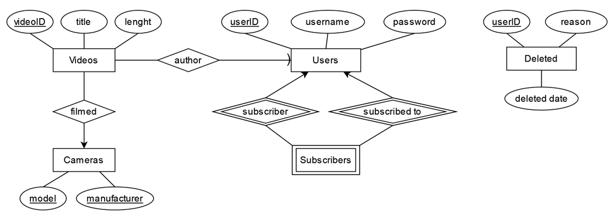
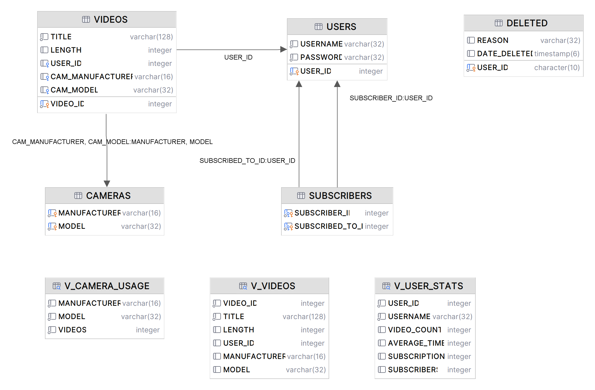

# VideoBase
A database for videos in DB2 and an app for manipulation written in Java.

## Database
### Structure
#### ER 

VIDEOS(**VIDEO_ID**, TITLE, LENGTH, *USER_ID*, *CAM_MODEL*, *CAM_MANUFACTURER*)  
CAMERAS(**MODEL**, **MANUFACTURER**)  
USERS(**USER_ID**, USERNAME, PASSWORD)  
SUBSCRIBERS(***SUBSCRIBER_ID***, ***SUBSCRIBED_TO_ID***)  
~~FILMED(**VIDEO_ID**, MODEL, MANUFACTURER)~~ X  
~~AUTHOR(**VIDEO_ID**, **USER_ID**)~~ X  
DELETED(**USER_ID**, REASON, DATE_DELETED)  

**Primary keys:**  
VIDEOS: PK(VIDEOID)  
CAMERAS: PK(MODEL, MANUFACTURER)  
USERS: PK(USERID)  
SUBSCRIBERS: PK(SUBSCRIBER_ID, SUBSCRIBED_TO_ID)  

*Foreign keys:*  
VIDEOS: FK(CAM_MODEL) -> CAMERAS(MODEL)  
VIDEOS: FK(CAM_MANUFACTURER) -> CAMERAS(MANUFACTURER)  
VIDEOS: FK(USER_ID) -> USERS(USER_ID)  
SUBSCRIBERS: FK(SUBSCRIBER_ID) -> USERS(USER_ID)  
SUBSCRIBERS: FK(SUBSCRIBED_TO_ID) -> USERS(USER_ID)  

Restrictions:  
VIDEOS: CK(LENGTH > 0)  
VIDEOS: CK(TITLE != ‘’)  
USERS: CK(LENGTH(PASSWORD) >= 8)  
USERS: CK(USERNAME NOT LIKE '% %')  
SUBSCRIBERS: CK(SUBSCRIBER_ID != SUBSCRIBED_TO_ID)  

#### Relational

### Sequences
* S_USER – used for generating IDs for USERS
* S_VIDEO – used for generating IDs for VIDEOS

### Views
* V_USER_STATS – shows number of videos, average length, number of subscriptions and number of subscribers of the current user
* V_CAMERA_USAGE – shows number of videos based on camera used
* V_VIDEOS – a view that allows adding videos with cameras which don't already exist in the database

### Triggers
* T_AFTER_DEL_USER – on user deletion adds the selected user in deleted
* T_INSTEAD_INS_V_VIDEOS – on inserting a record in V_VIDEOS adds the camera information to CAMERAS and video record to VIDEOS

### Functions
* F_GET_USERNAME(P_USER_ID) – returns a scalar username on given user_id
* F_USER_SUBSCRIPTIONS(P_USER_ID) – returns a table of a user's subscriptions (formated user_id, username) on given user_id
* F_USER_VIDEOS(P_USER_ID) – returns a table of a user's videos (formated like VIDEOS but without user_id) on given user_id
* F_USER_STATS(P_USER_ID) – returns a table of user statistics (number of videos, average length, number of subscriptions, number of subscribers) on given user_id

## App
### Classes
* ConnectionInfo - record of information about connection
* DB2API - layer between the driver and the application
* LoadConfig - class used for checking the existence and validity of the connection.properties file
* VideoPlatform - class containing functions to manipulate the database
* Command - class that interprets string as command and executes the according function
* Application - command interface of the app

### Commands and queries

Arguments: **required**, *optional*

    
get <b>user|video</b> <b>ID</b>

    <ul>
        <li>
            user
             
            <code class="language-sql">
                DELETE FROM USERS WHERE USER_ID = ID
            </code>
        </li>
        <li>
            video
             
            <code class="language-sql">
                DELETE FROM VIDEOS WHERE VIDEO_ID = ID
            </code>
        </li>
    </ul>

    
show <b>users|cameras|videos|deleted_users|user_overview|camera_usage</b>

    <ul>
        <li>
            users
             
            <code class="language-sql">
                SELECT USER_ID,USERNAME FROM USERS
            </code>
        </li>
        <li>
            cameras
             
            <code class="language-sql">
                SELECT * FROM CAMERAS
            </code>
        </li>
        <li>
            videos
             
            <code class="language-sql">
                SELECT * FROM VIDEOS
            </code>
        </li>
        <li>
            deleted_users
             
            <code class="language-sql">
                SELECT * FROM DELETED
            </code>
        </li>
        <li>
            user_overview
             
            <code class="language-sql">
                SELECT * FROM V_USER_STATS
            </code>
        </li>
        <li>
            camera_usage
             
            <code class="language-sql">
                SELECT * FROM V_CAMERA_USAGE
            </code>
        </li>
    </ul>

    
user <b>username|overview|videos|subscriptions</b> <b>ID</b>

    <ul>
        <li>
            username
             
            <code class="language-sql">
                VALUES VIDEOBASE.F_USERNAME(userID)
            </code>
        </li>
        <li>
            overview
             
            <code class="language-sql">
                SELECT * FROM TABLE(VIDEOBASE.F_USER_STATS(3)) T
            </code>
        </li>
        <li>
            videos
             
            <code class="language-sql">
                SELECT * FROM TABLE(VIDEOBASE.F_USER_VIDEOS(3)) T
            </code>
        </li>
        <li>
            subscriptions
             
            <code class="language-sql">
                SELECT * FROM TABLE(VIDEOBASE.F_USER_SUBSCRIPTIONS(6)) T
            </code>
        </li>
    </ul>

    
delete <b>user|video</b> <b>ID</b>

    <ul>
        <li>
            user
             
            <code class="language-sql">
                DELETE FROM USERS WHERE USER_ID = ID
            </code>
        </li>
        <li>
            video
             
            <code class="language-sql">
                DELETE FROM VIDEOS WHERE VIDEO_ID = ID
            </code>
        </li>
    </ul>

    
rename <b>user|video</b> <b>ID</b> <b>new_name</b>

    <ul>
        <li>
            user
             
            <code class="language-sql">
                UPDATE USERS SET USERNAME = ‘new_name’ WHERE USER_ID = ID
            </code>
        </li>
        <li>
            video
             
            <code class="language-sql">
                UPDATE VIDEOS SET TITLE = ‘new_name’ WHERE VIDEO_ID = ID
            </code>
        </li>
    </ul>

    
upload <b>user_ID</b> <b>title</b> <b>length</b> <i>cam_manufacturer,cam_mod</i> 

    <ul>
        <li>
            without <i>cam_manufacturer,cam_mod</i>
             
            <code class="language-sql">
                INSERT INTO V_VIDEOS VALUES (NEXTVAL FOR S_VIDEO,'title',length,userID,null,null)
            </code>
        </li>
        <li>
            with <i>cam_manufacturer,cam_mod</i>
             
            <code class="language-sql">
                INSERT INTO V_VIDEOS VALUES (NEXTVAL FOR S_VIDEO,'title',length,userID,cam_man,cam_mod)
            </code>
        </li>
    </ul>

    
register <b>username</b> <b>password</b>

        <code class="language-sql">
            INSERT INTO USERS VALUES (NEXTVAL FOR S_USER,’username’,’password’)
        </code>

    
ban <b>user_ID</b> <i>reason</i>

    <ul>
        <li>
            without <i>reason</i>
             
            <code class="language-sql">
                DELETE FROM USERS WHERE USER_ID = userID
            </code>
        </li>
        <li>
            with <i>reason</i>
             
            <code class="language-sql">
                DELETE FROM USERS WHERE USER_ID = userID
                 
                UPDATE DELETED SET REASON = 'BANNED + reason' WHERE USER_ID = userID
            </code>
        </li>
    </ul>

    
subscribe <b>user_ID</b> <b>creator_ID</b>

        <code class="language-sql">
        INSERT INTO SUBSCRIBERS VALUES (user_ID,creator_ID)
        </code>

    
unsubscribe <b>user_ID</b> <b>creator_ID</b>

        <code class="language-sql">
        DELETE FROM SUBSCRIBERS WHERE SUBSCRIBER_ID = user_ID AND SUBSCRIBED_TO_ID = creator_ID
        </code>

    
exit

